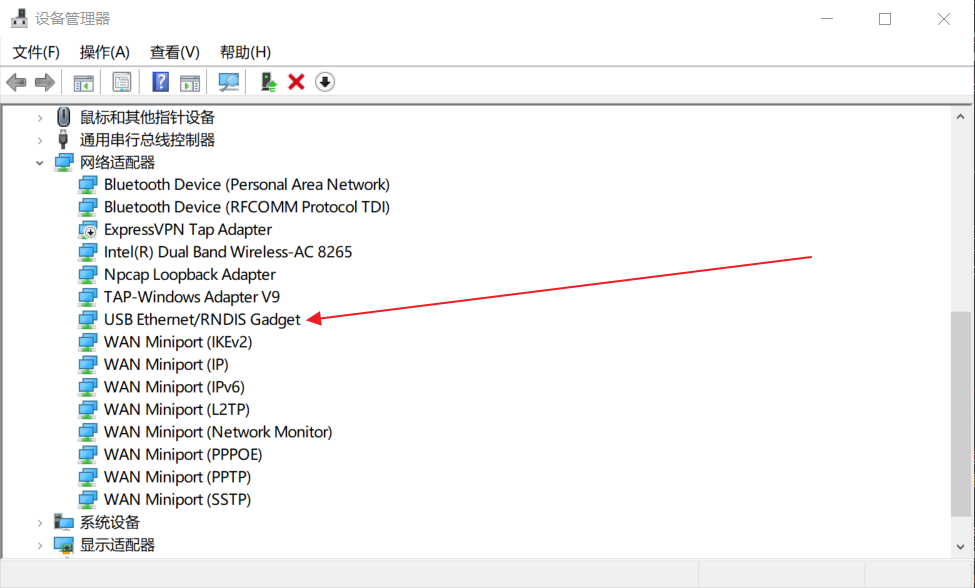
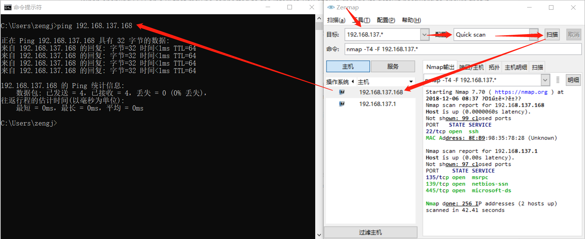

# OTG To Ethernet

## 参考文档

* [Jan Raspberry Pi Zero W Headless setup – Windows 10 RNDIS Driver issue resolved](https://www.factoryforward.com/pi-zero-w-headless-setup-windows10-rndis-driver-issue-resolved/)
* [Putty "Unknown error" using SSH with pi zero over USB](https://www.raspberrypi.org/forums/viewtopic.php?t=215520)
* [SSH (Secure Shell)](https://github.com/raspberrypi/documentation/blob/master/remote-access/ssh/README.md)

## 支持USB转Ethernet

* `/boot/cmdline.txt`: 第一行尾添加`modules-load=dwc2,g_ether`；
* `/boot/config.txt`: 文件最后添加`dtoverlay=dwc2`；
* 开启SSH：For headless setup, SSH can be enabled by placing a file named ssh, without any extension, onto the boot partition of the SD card from another computer. When the Pi boots, it looks for the ssh file. If it is found, SSH is enabled and the file is deleted. The content of the file does not matter; it could contain text, or nothing at all.
* 参考第一篇参考文档；

## 注意问题

* Windows 10上使用OTG转网卡会出现识别到串口的问题，需要换驱动，参考文档中第一篇有解决方法；[`OTG To Ethernet`驱动](refers/mod-duo-rndis.zip)  
  
* 让树莓派通过USB获取网络：
  * 在有网的网口共享到树莓派USB生成的网口，网卡设定里进行网络共享；
  * 树莓派在PC机上生成的网口变成了网关，可以直接查看树莓派网段地址：`192.168.137.1`；
  * 使用Windows下的nmap进行IP扫描：`192.168.137.168`  
    
* 在使用Putty通过Hostname进行SSH连接访问的时候会出现找不到的问题，建议直接用IP访问；
* 桌面版的系统启动稍微有点慢，终端板的系统快一些，在`raspi-config`命令中可以选择终端或者桌面模式；
