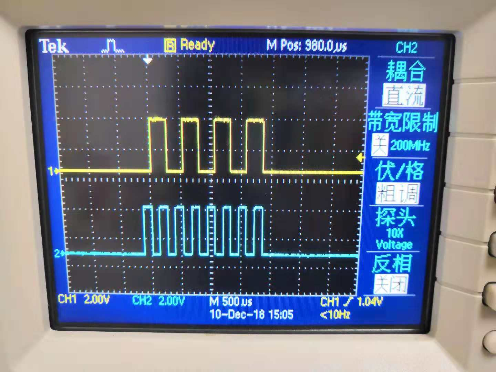

# SPI

## 参考文档

* [SPI通讯协议介绍](https://blog.csdn.net/qq_29344757/article/details/76855350)
* [树莓派系列教程18：SPI](http://www.waveshare.net/study/article-625-1.html)
* [树莓派2B调试SPI接口](https://www.mobibrw.com/2018/13291)

## 基本操作

* 在`raspi-config`命令中打开SPI功能就行了，树莓派Linux系统会利用设备树Overlays将SPI引脚进行复用选择，注意需要重启；
* 树莓派上会生成2个SPI的设备节点，对应两个SPI片选设备：
  ```
  pi@raspberrypi:~ $ ls /dev/spi*
  /dev/spidev0.0  /dev/spidev0.1
  ```
* [spi-tools](https://github.com/cpb-/spi-tools)
  ```
  pi@raspberrypi:~/zengjf/spi-tools-master $ autoreconf -fim
  configure.ac:13: installing './compile'
  configure.ac:7: installing './install-sh'
  configure.ac:7: installing './missing'
  src/Makefile.am: installing './depcomp'
  pi@raspberrypi:~/zengjf/spi-tools-master $ ./configure
  checking for a BSD-compatible install... /usr/bin/install -c
  checking whether build environment is sane... yes
  checking for a thread-safe mkdir -p... /bin/mkdir -p
  checking for gawk... no
  checking for mawk... mawk
  checking whether make sets $(MAKE)... yes
  checking whether make supports nested variables... yes
  checking whether to enable maintainer-specific portions of Makefiles... no
  checking whether make sets $(MAKE)... (cached) yes
  checking for gcc... gcc
  [...省略]
  configure: Debug Mode off.
  checking for help2man... echo No help2man
  checking that generated files are newer than configure... done
  configure: creating ./config.status
  config.status: creating Makefile
  config.status: creating src/Makefile
  config.status: creating man/Makefile
  config.status: creating src/config.h
  config.status: executing depfiles commands
  pi@raspberrypi:~/zengjf/spi-tools-master $ make
  Making all in src
  make[1]: Entering directory '/home/pi/zengjf/spi-tools-master/src'
  make  all-am
  make[2]: Entering directory '/home/pi/zengjf/spi-tools-master/src'
  gcc -DHAVE_CONFIG_H -I.     -O0  -MT spi-config.o -MD -MP -MF .deps/spi-config.Tpo -c -o spi-config.o spi-config.c
  mv -f .deps/spi-config.Tpo .deps/spi-config.Po
  gcc  -O0    -o spi-config spi-config.o
  gcc -DHAVE_CONFIG_H -I.     -O0  -MT spi-pipe.o -MD -MP -MF .deps/spi-pipe.Tpo -c -o spi-pipe.o spi-pipe.c
  mv -f .deps/spi-pipe.Tpo .deps/spi-pipe.Po
  gcc  -O0    -o spi-pipe spi-pipe.o
  make[2]: Leaving directory '/home/pi/zengjf/spi-tools-master/src'
  make[1]: Leaving directory '/home/pi/zengjf/spi-tools-master/src'
  Making all in man
  make[1]: Entering directory '/home/pi/zengjf/spi-tools-master/man'
  make[1]: Nothing to be done for 'all'.
  make[1]: Leaving directory '/home/pi/zengjf/spi-tools-master/man'
  make[1]: Entering directory '/home/pi/zengjf/spi-tools-master'
  make[1]: Nothing to be done for 'all-am'.
  make[1]: Leaving directory '/home/pi/zengjf/spi-tools-master'
  pi@raspberrypi:~/zengjf/spi-tools-master $ sudo make install
  Making install in src
  make[1]: Entering directory '/home/pi/zengjf/spi-tools-master/src'
  make[2]: Entering directory '/home/pi/zengjf/spi-tools-master/src'
   /bin/mkdir -p '/usr/local/bin'
    /usr/bin/install -c spi-config spi-pipe '/usr/local/bin'
  make[2]: Nothing to be done for 'install-data-am'.
  make[2]: Leaving directory '/home/pi/zengjf/spi-tools-master/src'
  make[1]: Leaving directory '/home/pi/zengjf/spi-tools-master/src'
  Making install in man
  make[1]: Entering directory '/home/pi/zengjf/spi-tools-master/man'
  make[2]: Entering directory '/home/pi/zengjf/spi-tools-master/man'
  make[2]: Nothing to be done for 'install-exec-am'.
   /bin/mkdir -p '/usr/local/share/man/man1'
   /usr/bin/install -c -m 644 spi-config.1 spi-pipe.1 '/usr/local/share/man/man1'
  make[2]: Leaving directory '/home/pi/zengjf/spi-tools-master/man'
  make[1]: Leaving directory '/home/pi/zengjf/spi-tools-master/man'
  make[1]: Entering directory '/home/pi/zengjf/spi-tools-master'
  make[2]: Entering directory '/home/pi/zengjf/spi-tools-master'
  make[2]: Nothing to be done for 'install-exec-am'.
  make[2]: Nothing to be done for 'install-data-am'.
  make[2]: Leaving directory '/home/pi/zengjf/spi-tools-master'
  make[1]: Leaving directory '/home/pi/zengjf/spi-tools-master'
  ```
* `spi-config`帮助：
  ```
  pi@raspberrypi:~/zengjf/spi-tools-master $ spi-config -h
  usage: spi-config options...
    options:
      -d --device=<dev>  use the given spi-dev character device.
      -q --query         print the current configuration.
      -m --mode=[0-3]    use the selected spi mode:
               0: low idle level, sample on leading edge,
               1: low idle level, sample on trailing edge,
               2: high idle level, sample on leading edge,
               3: high idle level, sample on trailing edge.
      -l --lsb={0,1}     LSB first (1) or MSB first (0).
      -b --bits=[7...]   bits per word.
      -s --speed=<int>   set the speed in Hz.
      -r --spirdy={0,1}  consider SPI_RDY signal (1) or ignore it (0).
      -w --wait          block keeping the file descriptor open to avoid speed reset.
      -h --help          this screen.
      -v --version       display the version number.
  ```
* 获取当前SPI接口信息：
  ```
  pi@raspberrypi:~/zengjf/spi-tools-master $ spi-config -d /dev/spidev0.0 -q
  /dev/spidev0.0: mode=0, lsb=0, bits=8, speed=125000000, spiready=0
  ```
* **Note**: on some platforms, the speed is reset to a default value when the file descriptor is closed. To avoid this, one can use the -w option that keep the file descriptor open.
* 树莓派的SPI在关闭SPI设备描述符之后会恢复原来的值，所以需要使用上面的打开文件描述符后台运行的方式解决；
  ```
  pi@raspberrypi:~/zengjf/spi-tools-master $ spi-config -d /dev/spidev0.0 -s 10000000 -w &
  [1] 3416
  pi@raspberrypi:~/zengjf/spi-tools-master $ spi-config -d /dev/spidev0.0 -q
  /dev/spidev0.0: mode=0, lsb=0, bits=8, speed=10000000, spiready=0
  ```
* `spi-pipe`帮助：
  ```
  pi@raspberrypi:~/zengjf/spi-tools-master $ spi-pipe -h
  usage: spi-pipe options...
    options:
      -d --device=<dev>    use the given spi-dev character device.
      -s --speed=<speed>   Maximum SPI clock rate (in Hz).
      -b --blocksize=<int> transfer block size in byte.
      -n --number=<int>    number of blocks to transfer (-1 = infinite).
      -h --help            this screen.
      -v --version         display the version number.
  ```
* 解读`spi-pipe`发送数据部分代码：
  ```C
  // int           blocksize   =  1;
  // int           blocknumber = -1;
  
  while ((blocknumber > 0) || (blocknumber == -1)) {                                  // 循环多少个块
      for (offset = 0; offset < blocksize; offset += nb) {
          nb = read(STDIN_FILENO, & (tx_buffer[offset]), blocksize - offset);         // 从标准输入读取一块字节
          if (nb <= 0)
              break;
      }
      if (nb <= 0)
          break;
  
      if (ioctl(fd, SPI_IOC_MESSAGE(1), & transfer) < 0) {                            // 发送数据块
          perror("SPI_IOC_MESSAGE");
          break;
      }
      if (write(STDOUT_FILENO, rx_buffer, blocksize) <= 0)                            // 将当前块数据写到标准输出
          break;
      if (blocknumber > 0)
          blocknumber --;
  }
  ```
* 如上，如果需要发送二进制数据，参考: [How to write binary data in bash](https://stackoverflow.com/questions/43214001/how-to-write-binary-data-in-bash)
  ```Shell
  printf '\x03' > file   # Hex
  printf '\003' > file   # Octal
  ```
* `printf '\x55' | spi-pipe -d /dev/spidev0.1 -s 1000`  
  
* 硬件上短接MOSI/MISO，在使用的时候数据能收到，只是貌似spi-pipe往标准输出打印内容的时候有点问题，将下面语句放在脚本内执行是可行的；
  * `printf "\x55" | ./spi-pipe -d /dev/spidev0.0 -s 100 | hexdump`
    ```
    0000000 0055
    0000001
    ```