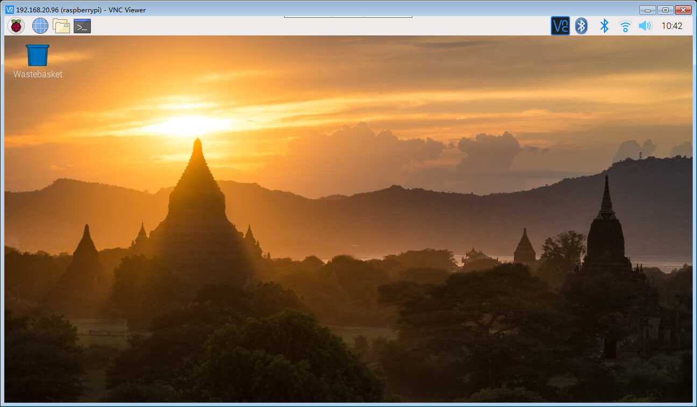

# VNC Connect

## 参考文档

* [VNC (Virtual Network Computing)](https://www.raspberrypi.org/documentation/remote-access/vnc/)
* [VNC Connect and Raspberry Pi](https://help.realvnc.com/hc/en-us/articles/360002249917-VNC-Connect-and-Raspberry-Pi#setting-up-your-raspberry-pi-0-0)

## 基本操作

* sudo apt-get update
* sudo apt-get install realvnc-vnc-server realvnc-vnc-viewer
* sudo raspi-config
  * Navigate to `Interfacing Options`.
  * `VNC` -> `Yes`.
* 下载[VNC viewer](https://www.realvnc.com/en/connect/download/viewer/)
  * 设置登录账号、密码即可连接；
    * 账号：pi；
    * 密码：raspberry；

## 屏幕分辨率

* `sudo raspi-config`
  * Advanced Options 
    * Resolution
* resolutions
  ```
      ┌──────────────────────────────────────────────────────────┐
      │ Choose screen resolution                                 │
      │                                                          │
      │             Default     720x480                          │
      │             DMT Mode 4  640x480 60Hz 4:3                 │
      │             DMT Mode 9  800x600 60Hz 4:3                 │
      │             DMT Mode 16 1024x768 60Hz 4:3                │
      │             DMT Mode 85 1280x720 60Hz 16:9               │
      │             DMT Mode 35 1280x1024 60Hz 5:4               │
      │             DMT Mode 51 1600x1200 60Hz 4:3               │
      │             DMT Mode 82 1920x1080 60Hz 16:9              │
      │                                                          │
      │                                                          │
      │                                                          │
      │                                                          │
      │                                                          │
      │                                                          │
      │              <Ok>                  <Cancel>              │
      │                                                          │
      └──────────────────────────────────────────────────────────┘
  ```
* `DMT Mode 85 1280x720 60Hz 16:9`  
  