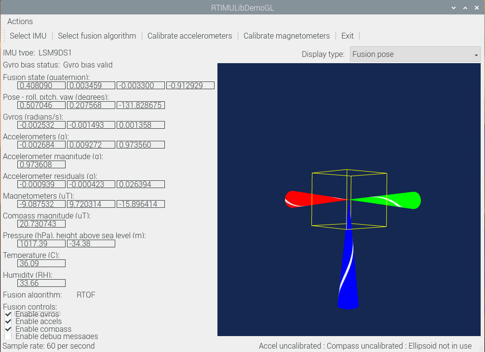

# RTIMULib

## Source code

https://github.com/RPi-Distro/RTIMULib/tree/master/Linux

## Dependens

* `sudo apt-get install cmake`
* `sudo apt-get install libqt4-dev`

## Build RTIMULib lib

* https://github.com/RPi-Distro/RTIMULib/tree/master/Linux#build-using-cmake
* build log
  ```Console
  pi@raspberrypi:~/zengjf $ git clone https://github.com/RPi-Distro/RTIMULib.git
  Cloning into 'RTIMULib'...
  remote: Enumerating objects: 5, done.
  remote: Counting objects: 100% (5/5), done.
  remote: Compressing objects: 100% (5/5), done.
  remote: Total 1538 (delta 0), reused 1 (delta 0), pack-reused 1533
  Receiving objects: 100% (1538/1538), 1.45 MiB | 7.00 KiB/s, done.
  Resolving deltas: 100% (1095/1095), done.
  pi@raspberrypi:~/zengjf $ cd RTIMULib/
  pi@raspberrypi:~/zengjf/RTIMULib $ ls
  Calibration.pdf  LICENSE  Linux  README.md  RTEllipsoidFit  RTHost  RTIMULib  RTIMULibVersion.txt
  pi@raspberrypi:~/zengjf/RTIMULib $ cd RTIMULib/
  pi@raspberrypi:~/zengjf/RTIMULib/RTIMULib $ ls
   CMakeLists.txt   RTFusion.h            RTFusionRTQF.cpp    RTIMUAccelCal.h   RTIMUHal.h      'RTIMULIB LICENSE'   RTIMUMagCal.h       RTMath.cpp
   IMUDrivers       RTFusionKalman4.cpp   RTFusionRTQF.h      RTIMUCalDefs.h    RTIMULibDefs.h   RTIMULib.pri        RTIMUSettings.cpp   RTMath.h
   RTFusion.cpp     RTFusionKalman4.h     RTIMUAccelCal.cpp   RTIMUHal.cpp      RTIMULib.h       RTIMUMagCal.cpp     RTIMUSettings.h
  pi@raspberrypi:~/zengjf/RTIMULib/RTIMULib $ mkdir build
  pi@raspberrypi:~/zengjf/RTIMULib/RTIMULib $ cd build
  pi@raspberrypi:~/zengjf/RTIMULib/RTIMULib/build $ cmake ..
  -- The CXX compiler identification is GNU 8.3.0
  -- Check for working CXX compiler: /usr/bin/c++
  -- Check for working CXX compiler: /usr/bin/c++ -- works
  -- Detecting CXX compiler ABI info
  -- Detecting CXX compiler ABI info - done
  -- Detecting CXX compile features
  -- Detecting CXX compile features - done
  -- Configuring done
  -- Generating done
  -- Build files have been written to: /home/pi/zengjf/RTIMULib/RTIMULib/build
  pi@raspberrypi:~/zengjf/RTIMULib/RTIMULib/build $ make -j4
  Scanning dependencies of target RTIMULib
  [ 10%] Building CXX object CMakeFiles/RTIMULib.dir/RTFusionRTQF.cpp.o
  [ 10%] Building CXX object CMakeFiles/RTIMULib.dir/RTFusion.cpp.o
  [ 14%] Building CXX object CMakeFiles/RTIMULib.dir/RTMath.cpp.o
  [ 14%] Building CXX object CMakeFiles/RTIMULib.dir/RTFusionKalman4.cpp.o
  [ 17%] Building CXX object CMakeFiles/RTIMULib.dir/RTIMUAccelCal.cpp.o
  [ 21%] Building CXX object CMakeFiles/RTIMULib.dir/RTIMUHal.cpp.o
  [ 25%] Building CXX object CMakeFiles/RTIMULib.dir/RTIMUMagCal.cpp.o
  [ 28%] Building CXX object CMakeFiles/RTIMULib.dir/RTIMUSettings.cpp.o
  [ 32%] Building CXX object CMakeFiles/RTIMULib.dir/IMUDrivers/RTIMU.cpp.o
  [ 35%] Building CXX object CMakeFiles/RTIMULib.dir/IMUDrivers/RTIMUGD20M303DLHC.cpp.o
  [ 39%] Building CXX object CMakeFiles/RTIMULib.dir/IMUDrivers/RTIMUGD20HM303DLHC.cpp.o
  [ 42%] Building CXX object CMakeFiles/RTIMULib.dir/IMUDrivers/RTIMUGD20HM303D.cpp.o
  [ 46%] Building CXX object CMakeFiles/RTIMULib.dir/IMUDrivers/RTIMULSM9DS0.cpp.o
  [ 50%] Building CXX object CMakeFiles/RTIMULib.dir/IMUDrivers/RTIMULSM9DS1.cpp.o
  [ 53%] Building CXX object CMakeFiles/RTIMULib.dir/IMUDrivers/RTIMUMPU9150.cpp.o
  [ 57%] Building CXX object CMakeFiles/RTIMULib.dir/IMUDrivers/RTIMUMPU9250.cpp.o
  [ 60%] Building CXX object CMakeFiles/RTIMULib.dir/IMUDrivers/RTIMUBMX055.cpp.o
  [ 64%] Building CXX object CMakeFiles/RTIMULib.dir/IMUDrivers/RTIMUBNO055.cpp.o
  [ 67%] Building CXX object CMakeFiles/RTIMULib.dir/IMUDrivers/RTIMUNull.cpp.o
  [ 71%] Building CXX object CMakeFiles/RTIMULib.dir/IMUDrivers/RTPressure.cpp.o
  [ 75%] Building CXX object CMakeFiles/RTIMULib.dir/IMUDrivers/RTPressureBMP180.cpp.o
  [ 78%] Building CXX object CMakeFiles/RTIMULib.dir/IMUDrivers/RTPressureLPS25H.cpp.o
  [ 82%] Building CXX object CMakeFiles/RTIMULib.dir/IMUDrivers/RTPressureMS5611.cpp.o
  [ 85%] Building CXX object CMakeFiles/RTIMULib.dir/IMUDrivers/RTPressureMS5637.cpp.o
  [ 89%] Building CXX object CMakeFiles/RTIMULib.dir/IMUDrivers/RTHumidity.cpp.o
  [ 92%] Building CXX object CMakeFiles/RTIMULib.dir/IMUDrivers/RTHumidityHTS221.cpp.o
  [ 96%] Building CXX object CMakeFiles/RTIMULib.dir/IMUDrivers/RTHumidityHTU21D.cpp.o
  [100%] Linking CXX shared library libRTIMULib.so
  [100%] Built target RTIMULib
  pi@raspberrypi:~/zengjf/RTIMULib/RTIMULib/build $ sudo make install
  [100%] Built target RTIMULib
  Install the project...
  -- Install configuration: ""
  -- Installing: /usr/local/lib/libRTIMULib.so.7.2.1
  -- Installing: /usr/local/lib/libRTIMULib.so.7
  -- Installing: /usr/local/lib/libRTIMULib.so
  -- Up-to-date: /usr/local/include/.
  -- Installing: /usr/local/include/./RTFusionKalman4.h
  -- Installing: /usr/local/include/./RTFusionRTQF.h
  -- Installing: /usr/local/include/./RTFusion.h
  -- Installing: /usr/local/include/./RTIMUAccelCal.h
  -- Installing: /usr/local/include/./RTIMUHal.h
  -- Installing: /usr/local/include/./RTMath.h
  -- Installing: /usr/local/include/./IMUDrivers
  -- Installing: /usr/local/include/./IMUDrivers/RTIMUMPU9250.h
  -- Installing: /usr/local/include/./IMUDrivers/RTPressureLPS25H.h
  -- Installing: /usr/local/include/./IMUDrivers/RTPressureDefs.h
  -- Installing: /usr/local/include/./IMUDrivers/RTIMULSM9DS1.h
  -- Installing: /usr/local/include/./IMUDrivers/RTIMUNull.h
  -- Installing: /usr/local/include/./IMUDrivers/RTIMU.h
  -- Installing: /usr/local/include/./IMUDrivers/RTHumidityHTS221.h
  -- Installing: /usr/local/include/./IMUDrivers/RTIMUGD20HM303DLHC.h
  -- Installing: /usr/local/include/./IMUDrivers/RTPressureMS5637.h
  -- Installing: /usr/local/include/./IMUDrivers/RTHumidityHTU21D.h
  -- Installing: /usr/local/include/./IMUDrivers/RTHumidityDefs.h
  -- Installing: /usr/local/include/./IMUDrivers/RTPressureBMP180.h
  -- Installing: /usr/local/include/./IMUDrivers/RTIMUGD20M303DLHC.h
  -- Installing: /usr/local/include/./IMUDrivers/RTIMUBNO055.h
  -- Installing: /usr/local/include/./IMUDrivers/RTIMULSM9DS0.h
  -- Installing: /usr/local/include/./IMUDrivers/RTIMUDefs.h
  -- Installing: /usr/local/include/./IMUDrivers/RTIMUGD20HM303D.h
  -- Installing: /usr/local/include/./IMUDrivers/RTPressureMS5611.h
  -- Installing: /usr/local/include/./IMUDrivers/RTPressure.h
  -- Installing: /usr/local/include/./IMUDrivers/RTIMUBMX055.h
  -- Installing: /usr/local/include/./IMUDrivers/RTIMUMPU9150.h
  -- Installing: /usr/local/include/./IMUDrivers/RTHumidity.h
  -- Installing: /usr/local/include/./RTIMULibDefs.h
  -- Installing: /usr/local/include/./RTIMUSettings.h
  -- Installing: /usr/local/include/./build
  -- Installing: /usr/local/include/./build/CMakeFiles
  -- Installing: /usr/local/include/./build/CMakeFiles/RTIMULib.dir
  -- Installing: /usr/local/include/./build/CMakeFiles/RTIMULib.dir/IMUDrivers
  -- Installing: /usr/local/include/./build/CMakeFiles/CMakeTmp
  -- Installing: /usr/local/include/./build/CMakeFiles/3.13.4
  -- Installing: /usr/local/include/./build/CMakeFiles/3.13.4/CompilerIdCXX
  -- Installing: /usr/local/include/./build/CMakeFiles/3.13.4/CompilerIdCXX/tmp
  -- Installing: /usr/local/include/./RTIMULib.h
  -- Installing: /usr/local/include/./RTIMUCalDefs.h
  -- Installing: /usr/local/include/./RTIMUMagCal.h
  pi@raspberrypi:~/zengjf/RTIMULib/RTIMULib/build $ sudo ldconfig
  pi@raspberrypi:~/zengjf/RTIMULib/RTIMULib/build $ ls
  CMakeCache.txt  CMakeFiles  cmake_install.cmake  CTestTestfile.cmake  install_manifest.txt  libRTIMULib.so  libRTIMULib.so.7  libRTIMULib.so.7.2.1  Makefile
  pi@raspberrypi:~/zengjf/RTIMULib/RTIMULib/build $
  ```

## Build Linux demo

```Console
pi@raspberrypi:~/zengjf/RTIMULib/Linux $ ls
CMakeLists.txt  python  README.md  RTIMULibCal  RTIMULibDemo  RTIMULibDemoGL  RTIMULibDrive  RTIMULibDrive10  RTIMULibDrive11  RTIMULibGL  RTIMULibvrpn
pi@raspberrypi:~/zengjf/RTIMULib/Linux $ mkdir build
pi@raspberrypi:~/zengjf/RTIMULib/Linux $ cd build/
pi@raspberrypi:~/zengjf/RTIMULib/Linux/build $ cmake ..
-- The CXX compiler identification is GNU 8.3.0
-- Check for working CXX compiler: /usr/bin/c++
-- Check for working CXX compiler: /usr/bin/c++ -- works
-- Detecting CXX compiler ABI info
-- Detecting CXX compiler ABI info - done
-- Detecting CXX compile features
-- Detecting CXX compile features - done
-- Looking for Q_WS_X11
-- Looking for Q_WS_X11 - found
-- Looking for Q_WS_WIN
-- Looking for Q_WS_WIN - not found
-- Looking for Q_WS_QWS
-- Looking for Q_WS_QWS - not found
-- Looking for Q_WS_MAC
-- Looking for Q_WS_MAC - not found
-- Found Qt4: /usr/bin/qmake (found version "4.8.7")
CMake Deprecation Warning at /usr/share/cmake-3.13/Modules/FeatureSummary.cmake:719 (message):
  PRINT_ENABLED_FEATURES is deprecated.  Use

      feature_summary(WHAT ENABLED_FEATURES DESCRIPTION "Enabled features:")
Call Stack (most recent call first):
  CMakeLists.txt:97 (PRINT_ENABLED_FEATURES)


-- Enabled features:
 * RTIMULibGL
 * RTIMULibDrive, App that shows how to use the RTIMULib library in a basic way.
 * RTIMULibDrive10, App that shows to use  pressure/temperature sensors.
 * RTIMULibDrive11, App that shows to use  pressure/temperature/humidity sensors.
 * RTIMULibCal, Command line calibration tool for the magnetometers and accelerometers.
 * RTIMULibDemo, GUI app that displays the fused IMU data in real-time
 * RTIMULibDemoGL, RTIMULibDemo with OpenGL visualization

-- Using install prefix: /usr/local
-- Configuring done
-- Generating done
-- Build files have been written to: /home/pi/zengjf/RTIMULib/Linux/build
pi@raspberrypi:~/zengjf/RTIMULib/Linux/build $ make -j4
Scanning dependencies of target RTIMULib
[  2%] Building CXX object RTIMULib/CMakeFiles/RTIMULib.dir/RTFusion.cpp.o
[  3%] Building CXX object RTIMULib/CMakeFiles/RTIMULib.dir/RTMath.cpp.o
[  2%] Building CXX object RTIMULib/CMakeFiles/RTIMULib.dir/RTFusionRTQF.cpp.o
[  5%] Building CXX object RTIMULib/CMakeFiles/RTIMULib.dir/RTFusionKalman4.cpp.o
[  6%] Building CXX object RTIMULib/CMakeFiles/RTIMULib.dir/RTIMUAccelCal.cpp.o
[  7%] Building CXX object RTIMULib/CMakeFiles/RTIMULib.dir/RTIMUHal.cpp.o
[  9%] Building CXX object RTIMULib/CMakeFiles/RTIMULib.dir/RTIMUMagCal.cpp.o
[ 10%] Building CXX object RTIMULib/CMakeFiles/RTIMULib.dir/RTIMUSettings.cpp.o
[ 11%] Building CXX object RTIMULib/CMakeFiles/RTIMULib.dir/IMUDrivers/RTIMU.cpp.o
[ 12%] Building CXX object RTIMULib/CMakeFiles/RTIMULib.dir/IMUDrivers/RTIMUGD20M303DLHC.cpp.o
[ 14%] Building CXX object RTIMULib/CMakeFiles/RTIMULib.dir/IMUDrivers/RTIMUGD20HM303DLHC.cpp.o
[ 15%] Building CXX object RTIMULib/CMakeFiles/RTIMULib.dir/IMUDrivers/RTIMUGD20HM303D.cpp.o
[ 16%] Building CXX object RTIMULib/CMakeFiles/RTIMULib.dir/IMUDrivers/RTIMULSM9DS0.cpp.o
[ 18%] Building CXX object RTIMULib/CMakeFiles/RTIMULib.dir/IMUDrivers/RTIMULSM9DS1.cpp.o
[ 19%] Building CXX object RTIMULib/CMakeFiles/RTIMULib.dir/IMUDrivers/RTIMUMPU9150.cpp.o
[ 20%] Building CXX object RTIMULib/CMakeFiles/RTIMULib.dir/IMUDrivers/RTIMUMPU9250.cpp.o
[ 22%] Building CXX object RTIMULib/CMakeFiles/RTIMULib.dir/IMUDrivers/RTIMUBMX055.cpp.o
[ 23%] Building CXX object RTIMULib/CMakeFiles/RTIMULib.dir/IMUDrivers/RTIMUBNO055.cpp.o
[ 24%] Building CXX object RTIMULib/CMakeFiles/RTIMULib.dir/IMUDrivers/RTIMUNull.cpp.o
[ 27%] Building CXX object RTIMULib/CMakeFiles/RTIMULib.dir/IMUDrivers/RTPressureBMP180.cpp.o
[ 27%] Building CXX object RTIMULib/CMakeFiles/RTIMULib.dir/IMUDrivers/RTPressureLPS25H.cpp.o
[ 28%] Building CXX object RTIMULib/CMakeFiles/RTIMULib.dir/IMUDrivers/RTPressure.cpp.o
[ 29%] Building CXX object RTIMULib/CMakeFiles/RTIMULib.dir/IMUDrivers/RTPressureMS5611.cpp.o
[ 31%] Building CXX object RTIMULib/CMakeFiles/RTIMULib.dir/IMUDrivers/RTPressureMS5637.cpp.o
[ 32%] Building CXX object RTIMULib/CMakeFiles/RTIMULib.dir/IMUDrivers/RTHumidity.cpp.o
[ 33%] Building CXX object RTIMULib/CMakeFiles/RTIMULib.dir/IMUDrivers/RTHumidityHTS221.cpp.o
[ 35%] Building CXX object RTIMULib/CMakeFiles/RTIMULib.dir/IMUDrivers/RTHumidityHTU21D.cpp.o
[ 36%] Linking CXX shared library libRTIMULib.so
[ 36%] Built target RTIMULib
Scanning dependencies of target RTIMULibGL_autogen
Scanning dependencies of target RTIMULibDrive10
Scanning dependencies of target RTIMULibDrive
Scanning dependencies of target RTIMULibDrive11
[ 37%] Automatic MOC for target RTIMULibGL
[ 40%] Building CXX object RTIMULibDrive/CMakeFiles/RTIMULibDrive.dir/RTIMULibDrive.cpp.o
[ 40%] Building CXX object RTIMULibDrive10/CMakeFiles/RTIMULibDrive10.dir/RTIMULibDrive10.cpp.o
[ 41%] Building CXX object RTIMULibDrive11/CMakeFiles/RTIMULibDrive11.dir/RTIMULibDrive11.cpp.o
[ 42%] Linking CXX executable RTIMULibDrive
[ 44%] Linking CXX executable RTIMULibDrive10
[ 45%] Linking CXX executable RTIMULibDrive11
[ 45%] Built target RTIMULibDrive
[ 45%] Built target RTIMULibDrive10
[ 45%] Built target RTIMULibDrive11
Scanning dependencies of target RTIMULibCal
Scanning dependencies of target RTIMULibDemo_autogen
[ 46%] Automatic MOC for target RTIMULibDemo
[ 48%] Building CXX object RTIMULibCal/CMakeFiles/RTIMULibCal.dir/RTIMULibCal.cpp.o
[ 48%] Built target RTIMULibGL_autogen
[ 49%] Generating qrc_VRWidgetLib.cxx
Scanning dependencies of target RTIMULibGL
[ 50%] Linking CXX executable RTIMULibCal
[ 50%] Built target RTIMULibDemo_autogen
[ 51%] Generating ui_RTIMULibDemo.h
Scanning dependencies of target RTIMULibDemo
[ 53%] Building CXX object RTIMULibGL/CMakeFiles/RTIMULibGL.dir/IMUView.cpp.o
[ 54%] Building CXX object RTIMULibGL/CMakeFiles/RTIMULibGL.dir/QtGLLib/QtGLADSShader.cpp.o
[ 54%] Built target RTIMULibCal
[ 55%] Building CXX object RTIMULibDemo/CMakeFiles/RTIMULibDemo.dir/AccelCalDlg.cpp.o
[ 57%] Building CXX object RTIMULibDemo/CMakeFiles/RTIMULibDemo.dir/RTIMULibDemo.cpp.o
[ 58%] Building CXX object RTIMULibGL/CMakeFiles/RTIMULibGL.dir/QtGLLib/QtGLADSTextureShader.cpp.o
[ 59%] Building CXX object RTIMULibDemo/CMakeFiles/RTIMULibDemo.dir/IMUThread.cpp.o
[ 61%] Building CXX object RTIMULibGL/CMakeFiles/RTIMULibGL.dir/QtGLLib/QtGLComponent.cpp.o
[ 62%] Building CXX object RTIMULibGL/CMakeFiles/RTIMULibGL.dir/QtGLLib/QtGL.cpp.o
[ 63%] Building CXX object RTIMULibDemo/CMakeFiles/RTIMULibDemo.dir/MagCalDlg.cpp.o
[ 64%] Building CXX object RTIMULibGL/CMakeFiles/RTIMULibGL.dir/QtGLLib/QtGLCylinderComponent.cpp.o
[ 66%] Building CXX object RTIMULibDemo/CMakeFiles/RTIMULibDemo.dir/SelectIMUDlg.cpp.o
[ 67%] Building CXX object RTIMULibGL/CMakeFiles/RTIMULibGL.dir/QtGLLib/QtGLDiskComponent.cpp.o
[ 68%] Building CXX object RTIMULibGL/CMakeFiles/RTIMULibGL.dir/QtGLLib/QtGLFlatShader.cpp.o
[ 70%] Building CXX object RTIMULibDemo/CMakeFiles/RTIMULibDemo.dir/SelectFusionDlg.cpp.o
[ 71%] Building CXX object RTIMULibGL/CMakeFiles/RTIMULibGL.dir/QtGLLib/QtGLPlaneComponent.cpp.o
[ 72%] Building CXX object RTIMULibDemo/CMakeFiles/RTIMULibDemo.dir/main.cpp.o
[ 74%] Building CXX object RTIMULibGL/CMakeFiles/RTIMULibGL.dir/QtGLLib/QtGLSphereComponent.cpp.o
[ 75%] Building CXX object RTIMULibGL/CMakeFiles/RTIMULibGL.dir/QtGLLib/QtGLTextureShader.cpp.o
[ 76%] Building CXX object RTIMULibDemo/CMakeFiles/RTIMULibDemo.dir/RTIMULibDemo_autogen/mocs_compilation.cpp.o
[ 77%] Building CXX object RTIMULibGL/CMakeFiles/RTIMULibGL.dir/QtGLLib/QtGLWireCubeComponent.cpp.o
[ 79%] Linking CXX executable RTIMULibDemo
[ 79%] Built target RTIMULibDemo
[ 80%] Building CXX object RTIMULibGL/CMakeFiles/RTIMULibGL.dir/VRWidgetLib/VRIMUWidget.cpp.o
[ 81%] Building CXX object RTIMULibGL/CMakeFiles/RTIMULibGL.dir/VRWidgetLib/VRWidget.cpp.o
[ 83%] Building CXX object RTIMULibGL/CMakeFiles/RTIMULibGL.dir/qrc_VRWidgetLib.cxx.o
[ 84%] Building CXX object RTIMULibGL/CMakeFiles/RTIMULibGL.dir/RTIMULibGL_autogen/mocs_compilation.cpp.o
[ 85%] Linking CXX shared library libRTIMULibGL.so
[ 85%] Built target RTIMULibGL
Scanning dependencies of target RTIMULibDemoGL_autogen
[ 87%] Automatic MOC for target RTIMULibDemoGL
[ 87%] Built target RTIMULibDemoGL_autogen
[ 88%] Generating ui_RTIMULibDemoGL.h
Scanning dependencies of target RTIMULibDemoGL
[ 89%] Building CXX object RTIMULibDemoGL/CMakeFiles/RTIMULibDemoGL.dir/AccelCalDlg.cpp.o
[ 93%] Building CXX object RTIMULibDemoGL/CMakeFiles/RTIMULibDemoGL.dir/IMUThread.cpp.o
[ 93%] Building CXX object RTIMULibDemoGL/CMakeFiles/RTIMULibDemoGL.dir/MagCalDlg.cpp.o
[ 93%] Building CXX object RTIMULibDemoGL/CMakeFiles/RTIMULibDemoGL.dir/RTIMULibDemoGL.cpp.o
[ 94%] Building CXX object RTIMULibDemoGL/CMakeFiles/RTIMULibDemoGL.dir/SelectIMUDlg.cpp.o
[ 96%] Building CXX object RTIMULibDemoGL/CMakeFiles/RTIMULibDemoGL.dir/SelectFusionDlg.cpp.o
[ 97%] Building CXX object RTIMULibDemoGL/CMakeFiles/RTIMULibDemoGL.dir/main.cpp.o
[ 98%] Building CXX object RTIMULibDemoGL/CMakeFiles/RTIMULibDemoGL.dir/RTIMULibDemoGL_autogen/mocs_compilation.cpp.o
[100%] Linking CXX executable RTIMULibDemoGL
[100%] Built target RTIMULibDemoGL
pi@raspberrypi:~/zengjf/RTIMULib/Linux/build $ ls
CMakeCache.txt  CMakeFiles  cmake_install.cmake  CTestTestfile.cmake  Makefile  RTIMULib  RTIMULibCal  RTIMULibDemo  RTIMULibDemoGL  RTIMULibDrive  RTIMULibDrive10  RTIMULibDrive11  RTIMULibGL
```

## RTIMULibDemoGL

```Console
pi@raspberrypi:~/zengjf/RTIMULib/Linux/build $ cd RTIMULibDemoGL
pi@raspberrypi:~/zengjf/RTIMULib/Linux/build/RTIMULibDemoGL $ ls
CMakeFiles  cmake_install.cmake  CTestTestfile.cmake  Makefile  RTIMULibDemoGL  RTIMULibDemoGL_autogen  ui_RTIMULibDemoGL.h
pi@raspberrypi:~/zengjf/RTIMULib/Linux/build/RTIMULibDemoGL $ ./RTIMULibDemoGL
Settings file not found. Using defaults and creating settings file
Detected LSM9DS1 at standard/standard address
Using fusion algorithm RTQF
min/max compass calibration not in use
Ellipsoid compass calibration not in use
Accel calibration not in use
LSM9DS1 init complete
Detected LPS25H at standard address
Detected HTS221 at standard address
^C
```

