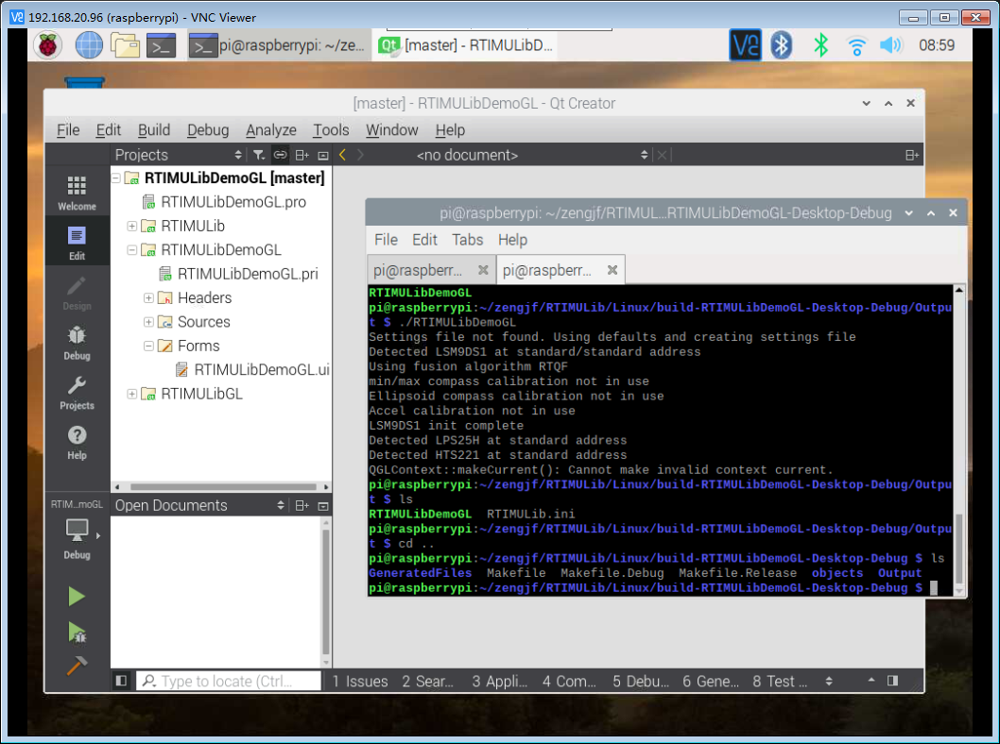

# Qt 4

## Dependens

* `sudo apt-get install cmake`
* `sudo apt-get install libqt4-dev`
* `sudo apt-get install qtcreator`

## RTIMULibDemoGL

```Console
pi@raspberrypi:~/zengjf/RTIMULib/Linux $ ls
build                               RTIMULibCal      RTIMULibDrive11
build-RTIMULibDemoGL-Desktop-Debug  RTIMULibDemo     RTIMULibGL
CMakeLists.txt                      RTIMULibDemoGL   RTIMULibvrpn
python                              RTIMULibDrive
README.md                           RTIMULibDrive10
pi@raspberrypi:~/zengjf/RTIMULib/Linux $ cd build-RTIMULibDemoGL-Desktop-Debug/
pi@raspberrypi:~/zengjf/RTIMULib/Linux/build-RTIMULibDemoGL-Desktop-Debug $ ls
GeneratedFiles  Makefile  Makefile.Debug  Makefile.Release  objects  Output
```

